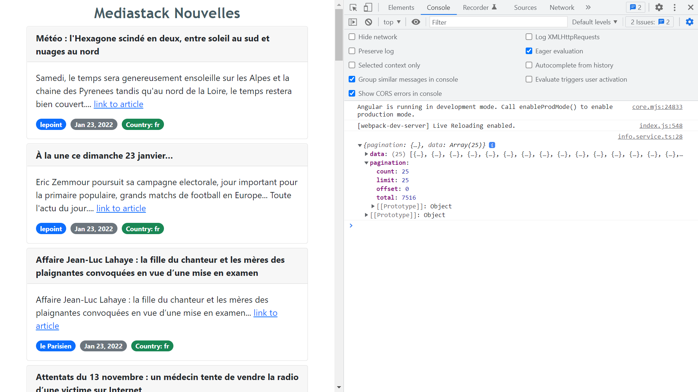

# :zap: Angular Bootstrap Info

* Angular app to show [mediastack Global News Data API](https://mediastack.com) data in a Bootstrap card array
* **Note:** to open web links in a new window use: _ctrl+click on link_


## :page_facing_up: Table of contents

* [:zap: Angular Bootstrap Info](#zap-angular-bootstrap-info)
  * [:page\_facing\_up: Table of contents](#page_facing_up-table-of-contents)
  * [:books: General info](#books-general-info)
  * [:camera: Screenshots](#camera-screenshots)
  * [:signal\_strength: Technologies](#signal_strength-technologies)
  * [:floppy\_disk: Setup](#floppy_disk-setup)
  * [:computer: Code Examples](#computer-code-examples)
  * [:cool: Features](#cool-features)
  * [:clipboard: Status \& To-Do List](#clipboard-status--to-do-list)
  * [:clap: Inspiration](#clap-inspiration)
  * [:file\_folder: License](#file_folder-license)
  * [:envelope: Contact](#envelope-contact)

## :books: General info

* Free news from the [mediastack REST API](https://mediastack.com) supplied in JSON format
* take(1), tap() and map() methods used to extract API data.
* Angular Async subscribe pipe used directly with the news response observable in the html template as it is auto-unsubscribing, instead of an observable subscription.

## :camera: Screenshots



## :signal_strength: Technologies

* [Angular v16](https://angular.io/)
* [Reactive Extensions Library for Javascript RXJS v7](https://rxjs-dev.firebaseapp.com/)
* [Bootstrap v5](https://getbootstrap.com/docs/5.0/getting-started/introduction/)
* [Live Server](https://www.npmjs.com/package/live-server)

## :floppy_disk: Setup

* Install dependencies using `npm i`
* Get an API key using [Mediastack Quickstart](https://mediastack.com/quickstart)
* Add API_KEY to `environment.ts` files
* Run `ng serve` for a dev server. Navigate to `http://localhost:4200/`. The app will automatically reload if you change any of the source files. Note: This will not work with Mediastack due to restrictions using http. See this [Stackoverflow for ways around HTTP restriction](https://stackoverflow.com/questions/75218904/aviationstack-api-error-https-encryption-not-supported). I created a build file then opened index.html using [Live Server](https://www.npmjs.com/package/live-server).
* Run `ng build` to build the project. The build artifacts will be stored in the `dist/` directory. Use the `--prod` flag for a production build.
* Run `ng update` to update Angular

## :computer: Code Examples

* `info.service.ts` HTTP request returns an observable data stream that I tapped using console.log

```typescript
    return this.http.get<ApiResponse>(apiUrl).pipe(
      take(1),
      map(res => res['data']),
      catchError(err => {
        throw 'an error occured: ' + err;
      }),
    );
```

## :cool: Features

* Use of Angular async pipe in HTML template reduces amount of code and auto-unsubscribes from the news data observable

## :clipboard: Status & To-Do List

* Status: Working
* To-Do: Add transloco, images? Change API? Add pagination??. Add click to data detail page.

## :clap: Inspiration

* [mediastack REST API](https://mediastack.com/documentation)
* [Stackoverflow for ways around HTTP restriction](https://stackoverflow.com/questions/75218904/aviationstack-api-error-https-encryption-not-supported)

## :file_folder: License

* This project is licensed under the terms of the MIT license.

## :envelope: Contact

* Repo created by [ABateman](https://github.com/AndrewJBateman), email: gomezbateman@yahoo.com
